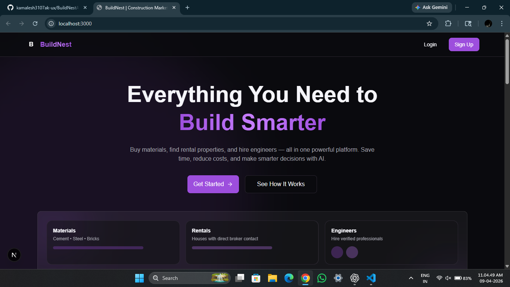
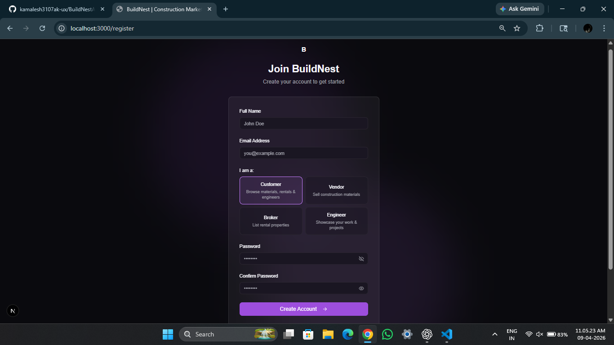
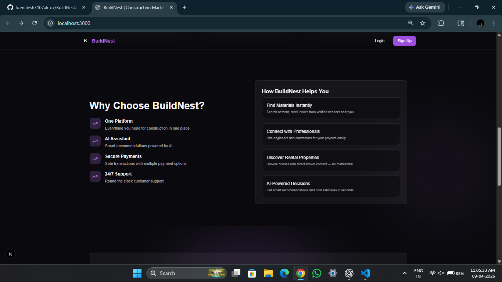

# BuildNest - Complete SaaS Application

## Overview
BuildNest is a premium, multi-role AI-powered construction marketplace built with Next.js, TypeScript, Tailwind CSS, Supabase, and Google Gemini AI.

## Architecture & Tech Stack

### Frontend
- **Next.js 16** (App Router)
- **TypeScript** for type safety
- **Tailwind CSS v4** with custom design tokens
- **ShadCN UI** components
- **Framer Motion** for smooth animations
- **Recharts** for data visualizations
- **AI SDK 6** for chat integration

### Backend
- **Next.js API Routes** for server-side logic
- **Supabase PostgreSQL** database
- **Supabase Auth** for authentication
- **Google Gemini 3-Flash** for AI responses

### Design System
- **Premium Dark Theme**: Dark purple and black with accent colors
- **Glassmorphism**: Glass effect components with backdrop blur
- **Smooth Animations**: Fade-in, slide-up, scale transitions
- **Responsive Design**: Mobile-first approach with Tailwind breakpoints

## Completed Modules

### 1. Authentication & Routes
✅ Landing Page with premium design
✅ Login page with password toggle
✅ Register page with role selection (customer, vendor, broker, engineer)
✅ Protected routes with role-based redirects
✅ Middleware for session management

### 2. Vendor Dashboard
✅ Overview with revenue, orders, products, pending stats
✅ Charts: Revenue trend, top products, order distribution
✅ Products page: Create, edit, delete products
✅ Add product modal with full form validation
✅ Orders management page
✅ Vendor profile with editable fields

### 3. Broker Dashboard
✅ Overview with listings, views, inquiries
✅ Charts: Views trend, top listings, property status
✅ Rental houses page: Create, edit, delete listings
✅ Contact details displayed on every listing
✅ Add rental modal with comprehensive fields
✅ Broker profile management

### 4. Engineer Dashboard
✅ Overview with posts, profile views, inquiries
✅ Charts: Views trend, inquiries, work type distribution
✅ Work posts page: Create, edit, delete posts
✅ Engineer post modal with all required fields
✅ AI Assistant page: Premium chat interface
✅ Engineer profile management

### 5. Customer Dashboard
✅ Overview with quick access to all features
✅ Materials marketplace: Browse vendor products
✅ Rentals page: Browse broker listings
✅ Engineers page: Browse and connect with engineers
✅ Shopping cart with full management
✅ Wishlist with save/unsave functionality
✅ Orders page tracking all purchases
✅ AI Assistant: Customer-friendly guidance
✅ Customer profile management
✅ Product detail pages with full information

### 6. AI Assistant Integration
✅ Google Gemini API integration
✅ Premium chat UI with typing indicators
✅ Example prompts for easy start
✅ Message history with smooth animations
✅ Specialized responses for engineers and customers
✅ Real-time streaming responses

### 7. Database Schema
✅ Complete PostgreSQL schema with 10+ tables:
  - profiles (user management)
  - products (vendor materials)
  - rental_houses (broker listings)
  - engineer_posts (engineer work showcase)
  - orders (customer purchases)
  - cart_items (shopping cart)
  - wishlist_items (saved items)
  - And more...

✅ Row Level Security (RLS) policies
✅ Proper foreign key relationships
✅ Indexes for performance

### 8. Premium UI Components
✅ Glassmorphic card designs
✅ Gradient accents and animations
✅ Loading skeletons
✅ Empty states
✅ Error handling
✅ Responsive grid layouts
✅ Modal dialogs for CRUD operations
✅ Data visualizations with Recharts

## Key Features

### For Vendors
- Dashboard with analytics
- Product management (CRUD)
- Order tracking and status updates
- Business profile management
- Revenue and performance metrics

### For Brokers
- Listing management
- Contact details on every post
- Performance analytics
- Property status tracking
- Professional profile

### For Engineers
- Work portfolio showcase
- Professional profile
- AI-powered guidance
- Project visibility
- Direct contact information

### For Customers
- Browse materials from vendors
- Find rental properties
- Connect with engineers
- Shopping cart and wishlist
- AI assistant for project planning
- Order tracking
- Account management

## Design Features

- **Premium Dark Theme**: Purple (#9d4edd) primary, accent (#c77dff), dark background
- **Smooth Animations**: Framer Motion transitions throughout
- **Responsive Layout**: Mobile-first design
- **Consistent Spacing**: Tailwind spacing scale
- **Clear Typography**: Geist font family
- **Interactive Elements**: Hover states, active states
- **Loading States**: Skeleton screens on all data-heavy pages
- **Error Handling**: Proper error messages and validation

## API Endpoints

### AI Chat
- `POST /api/ai/chat` - Streaming chat responses

## Security Features

- ✅ Row Level Security on all tables
- ✅ User authentication via Supabase
- ✅ Protected routes with middleware
- ✅ Role-based access control
- ✅ Email verification for signups
- ✅ Secure password hashing
- ✅ CORS configuration
- ✅ Input validation

## Performance Optimizations

- ✅ Server-side rendering where applicable
- ✅ Lazy loading of components
- ✅ Database indexing
- ✅ Efficient queries with proper selections
- ✅ Image optimization
- ✅ CSS optimization with Tailwind
- ✅ Code splitting with Next.js

## Scalability Ready

- ✅ Modular component architecture
- ✅ Reusable UI components
- ✅ Consistent state management patterns
- ✅ Database designed for growth
- ✅ API routes easily extensible
- ✅ Support for horizontal scaling

## Files Created

### Core Application
- `/app/page.tsx` - Premium landing page
- `/app/login/page.tsx` - Login with premium design
- `/app/register/page.tsx` - Registration with role selection
- `/app/globals.css` - Premium dark theme with animations
- `/middleware.ts` - Session and route protection

### Dashboard Infrastructure
- `/app/dashboard/layout.tsx` - Main layout
- `/app/dashboard/page.tsx` - Role-based redirect
- `/components/layout/dashboard-shell.tsx` - Sidebar and navigation

### Vendor Features (5+ pages)
- Dashboard overview with charts
- Products management
- Orders management
- Profile management

### Broker Features (3+ pages)
- Dashboard overview with charts
- Rental houses management
- Profile management

### Engineer Features (4+ pages)
- Dashboard overview with charts
- Work posts management
- AI assistant with streaming chat
- Profile management

### Customer Features (8+ pages)
- Dashboard overview
- Materials marketplace
- Rentals browsing
- Engineers browsing
- Shopping cart
- Wishlist management
- Orders tracking
- AI assistant
- Profile management
- Product details pages

### Reusable Components
- `/components/products/product-modal.tsx`
- `/components/rentals/rental-modal.tsx`
- `/components/engineer/engineer-post-modal.tsx`
- Shared shadcn UI components

### Database & API
- `/scripts/001_create_schema.sql` - Complete schema
- `/app/api/ai/chat/route.ts` - AI integration
- `/lib/types.ts` - TypeScript interfaces
- `/lib/supabase/` - Client and server setup

## How to Use

1. **Clone/Download** the project
2. **Install dependencies**: `npm install` or `pnpm install`
3. **Set up Supabase**:
   - Create a Supabase project
   - Run migrations from `/scripts/`
   - Set environment variables
4. **Set up Google Gemini API**:
   - Get API key from Google AI Studio
   - Add to environment variables
5. **Run development server**: `npm run dev`
6. **Access at** `http://localhost:3000`

## Environment Variables Required

```
NEXT_PUBLIC_SUPABASE_URL=
NEXT_PUBLIC_SUPABASE_ANON_KEY=
NEXT_PUBLIC_DEV_SUPABASE_REDIRECT_URL=
```

## Production Deployment

Ready for deployment on Vercel with:
- Automatic builds and deploys
- Environment variable management
- Edge functions support
- Built-in analytics

## 📸 Screenshots

### 🏠 Home Page


### 📝 Register Page


### ⭐ Features


---

**BuildNest is a complete, production-ready SaaS platform with premium UI, real backend logic, AI integration, and enterprise-grade architecture.**
